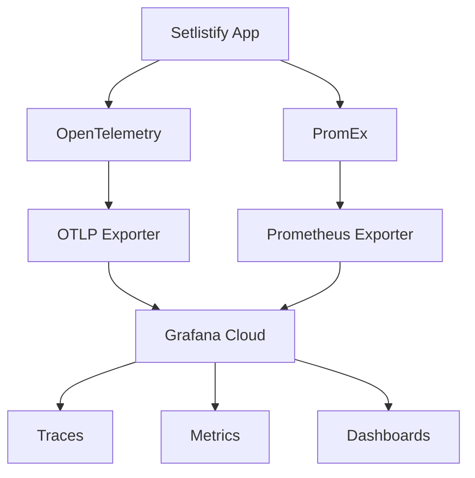

# Technical Specification: OpenTelemetry & PromEx Integration for Setlistify

## Table of Contents

1. [Overview](#1-overview)
2. [Architecture](#2-architecture)
3. [Technical Design](#3-technical-design)
4. [Implementation Plan](#4-implementation-plan)
5. [Observability Platform](#5-observability-platform)
6. [Monitoring Strategy](#6-monitoring-strategy)
7. [Risks and Mitigations](#7-risks-and-mitigations)
8. [Success Metrics](#8-success-metrics)

## 1. Overview

### 1.1 Goals

- Implement comprehensive distributed tracing across all API integrations
- Monitor user journeys from search to playlist creation
- Track performance metrics for cache effectiveness
- Establish baseline observability for debugging production issues
- Enable data-driven optimization of API calls and caching strategies
- Provide BEAM VM and application-level metrics via Prometheus

### 1.2 Success Criteria

- 100% of HTTP requests (inbound/outbound) are traced
- Cache hit/miss rates are observable via metrics
- P95 latency metrics available for all user-facing operations
- Error rates tracked for external API calls
- BEAM VM metrics collected and visualized
- Cost remains within free tier limits of chosen platform

## 2. Architecture

### 2.1 High-Level Design



### 2.2 Components

1. **OpenTelemetry**: Distributed tracing for request flows
2. **PromEx**: Prometheus metrics for application and BEAM metrics
3. **Grafana Cloud**: Unified observability platform
4. **Custom Instrumentation**: Cache operations and business logic

## 3. Technical Design

### 3.1 Dependencies

```elixir
# mix.exs
defp deps do
  [
    # existing deps...
    
    # Core OpenTelemetry
    {:opentelemetry, "~> 1.3"},
    {:opentelemetry_api, "~> 1.2"},
    {:opentelemetry_exporter, "~> 1.6"},
    
    # Auto-instrumentation libraries
    {:opentelemetry_phoenix, "~> 1.1"},
    {:opentelemetry_liveview, "~> 1.0.0-rc.4"},
    {:opentelemetry_cowboy, "~> 0.2"},
    {:opentelemetry_finch, "~> 1.0"},
    
    # Prometheus metrics
    {:prom_ex, "~> 1.9"},
    
    # Telemetry utilities
    {:telemetry_metrics, "~> 0.6"},
    {:telemetry_poller, "~> 1.0"}
  ]
end
```

### 3.2 OpenTelemetry Configuration

#### Base Configuration

```elixir
# config/config.exs
import Config

config :opentelemetry,
  resource: %{
    service: %{
      name: "setlistify",
      version: "0.1.0"
    },
    host: %{
      name: System.get_env("HOSTNAME", "localhost")
    }
  },
  span_processor: :batch,
  traces_exporter: :none  # Default for tests
```

#### Development Configuration

```elixir
# config/dev.exs
config :opentelemetry,
  traces_exporter: :console,
  span_processor: :simple
```

#### Production Configuration

```elixir
# config/prod.exs
config :opentelemetry_exporter,
  otlp_protocol: :http_protobuf,
  otlp_endpoint: {:system, "OTEL_EXPORTER_OTLP_ENDPOINT"},
  otlp_headers: [{:system, "OTEL_EXPORTER_OTLP_HEADERS"}]
  
config :opentelemetry,
  traces_exporter: :otlp,
  span_processor: :batch,
  batch_processor: %{
    max_queue_size: 5000,
    scheduled_delay_ms: 5000,
    exporter: :otlp
  }
```

### 3.3 PromEx Configuration

```elixir
# lib/setlistify/prom_ex.ex
defmodule Setlistify.PromEx do
  use PromEx, otp_app: :setlistify

  alias PromEx.Plugins

  @impl true
  def plugins do
    [
      # PromEx built-in plugins
      {Plugins.Application, metric_prefix: [:prom_ex, :application]},
      {Plugins.Beam, metric_prefix: [:prom_ex, :beam]},
      {Plugins.Phoenix, 
        metric_prefix: [:prom_ex, :phoenix],
        router: SetlistifyWeb.Router},
      {Plugins.PhoenixLiveView, metric_prefix: [:prom_ex, :phoenix_live_view]},
      
      # Custom plugin for our cache metrics
      {Setlistify.PromEx.CachePlugin, metric_prefix: [:prom_ex, :cache]}
    ]
  end

  @impl true
  def dashboard_assigns do
    [
      datasource_id: System.get_env("GRAFANA_PROMETHEUS_DATASOURCE_ID", "prometheus"),
      default_dashboard_uid: "setlistify-dashboard"
    ]
  end

  @impl true
  def dashboards do
    [
      # PromEx built-in dashboards
      {:prom_ex, "application.json"},
      {:prom_ex, "beam.json"},
      {:prom_ex, "phoenix.json"},
      {:prom_ex, "phoenix_live_view.json"},
      
      # Custom dashboard
      {:otp_app, "dashboards/cache.json"}
    ]
  end
end
```

### 3.4 Application Setup

```elixir
# lib/setlistify/application.ex
defmodule Setlistify.Application do
  use Application
  
  def start(_type, _args) do
    # Setup OpenTelemetry instrumentation
    setup_opentelemetry()
    
    children = [
      # existing children...
      
      # Add PromEx supervisor
      Setlistify.PromEx,
      
      # Custom telemetry handler
      {Setlistify.Telemetry, []},
      
      # Telemetry poller for custom metrics
      {:telemetry_poller,
       measurements: periodic_measurements(),
       period: 10_000}
    ]
    
    opts = [strategy: :one_for_one, name: Setlistify.Supervisor]
    Supervisor.start_link(children, opts)
  end
  
  defp setup_opentelemetry do
    OpentelemetryFinch.setup()
    OpentelemetryPhoenix.setup()
    OpentelemetryLiveView.setup()
    OpentelemetryCowboy.setup()
  end
  
  defp periodic_measurements do
    [
      {Setlistify.Metrics, :dispatch_cache_metrics, []}
    ]
  end
end
```

### 3.5 Custom Instrumentation

#### Cache Wrapper

```elixir
# lib/setlistify/instrumented_cache.ex
defmodule Setlistify.InstrumentedCache do
  require OpenTelemetry.Tracer, as: Tracer
  
  def fetch(cache_name, key, fallback_fn) do
    start_time = System.monotonic_time()
    
    Tracer.with_span "cache.fetch", %{
      attributes: %{
        "cache.name" => cache_name,
        "cache.key" => inspect(key)
      }
    } do
      result = Cachex.fetch(cache_name, key, fallback_fn)
      
      # Emit telemetry for PromEx
      :telemetry.execute(
        [:cachex, :operation],
        %{duration: System.monotonic_time() - start_time},
        %{
          cache_name: cache_name,
          operation: :fetch,
          result: elem(result, 0)
        }
      )
      
      case result do
        {:ok, value} ->
          Tracer.set_attribute("cache.hit", true)
          {:ok, value}
        {:commit, value} ->
          Tracer.set_attribute("cache.hit", false)
          {:commit, value}
        error ->
          Tracer.set_attribute("cache.error", true)
          error
      end
    end
  end
end
```

#### API Client Instrumentation

```elixir
# lib/setlistify/setlist_fm/api.ex
defmodule Setlistify.SetlistFm.API do
  require OpenTelemetry.Tracer, as: Tracer
  
  def search(query) do
    Tracer.with_span "setlist_fm.search", %{
      attributes: %{
        "setlist_fm.query" => query,
        "setlist_fm.operation" => "search"
      }
    } do
      :setlist_fm_search_cache 
      |> Setlistify.InstrumentedCache.fetch(query, &impl().search/1) 
      |> elem(1)
    end
  end
  
  def get_setlist(id) do
    Tracer.with_span "setlist_fm.get_setlist", %{
      attributes: %{
        "setlist_fm.setlist_id" => id,
        "setlist_fm.operation" => "get_setlist"
      }
    } do
      :setlist_fm_setlist_cache
      |> Setlistify.InstrumentedCache.fetch(id, &impl().get_setlist/1)
      |> elem(1)
    end
  end
  
  defp impl do
    Application.get_env(
      :setlistify,
      :setlistfm_api_client,
      Setlistify.SetlistFm.API.ExternalClient
    )
  end
end
```

### 3.6 Business Logic Instrumentation

```elixir
# lib/setlistify_web/live/playlists/show_live.ex
defmodule SetlistifyWeb.Playlists.ShowLive do
  require OpenTelemetry.Tracer, as: Tracer
  
  def handle_event("create_playlist", %{"setlist_id" => setlist_id}, socket) do
    Tracer.with_span "playlist.create", %{
      attributes: %{
        "playlist.setlist_id" => setlist_id,
        "playlist.user_id" => socket.assigns.current_user.id
      }
    } do
      with {:ok, setlist} <- fetch_setlist(setlist_id),
           {:ok, tracks} <- search_tracks(setlist),
           {:ok, playlist} <- create_spotify_playlist(setlist),
           :ok <- add_tracks_to_playlist(playlist, tracks) do
        
        Tracer.set_attribute("playlist.success", true)
        Tracer.set_attribute("playlist.track_count", length(tracks))
        
        # Emit business metric
        :telemetry.execute(
          [:setlistify, :playlist, :created],
          %{track_count: length(tracks)},
          %{user_id: socket.assigns.current_user.id}
        )
        
        {:noreply, assign(socket, :playlist, playlist)}
      else
        error ->
          Tracer.set_attribute("playlist.success", false)
          Tracer.set_attribute("playlist.error", inspect(error))
          
          {:noreply, put_flash(socket, :error, "Failed to create playlist")}
      end
    end
  end
end
```

### 3.7 Custom Metrics Plugin

```elixir
# lib/setlistify/prom_ex/plugins/cache.ex
defmodule Setlistify.PromEx.Plugins.Cache do
  use PromEx.Plugin

  @impl true
  def event_metrics(opts) do
    [
      # Cache hit/miss metrics
      counter_metric(
        metric_name: [:cache, :operations, :total],
        event_name: [:cachex, :operation],
        description: "Total cache operations",
        measurement: :count,
        tags: [:cache_name, :operation, :result]
      ),
      
      # Cache latency
      distribution_metric(
        metric_name: [:cache, :operation, :duration, :milliseconds],
        event_name: [:cachex, :operation],
        description: "Cache operation duration",
        measurement: :duration,
        unit: :millisecond,
        tags: [:cache_name, :operation]
      ),
      
      # Business metrics
      counter_metric(
        metric_name: [:playlist, :created, :total],
        event_name: [:setlistify, :playlist, :created],
        description: "Total playlists created",
        measurement: :count,
        tags: [:user_id]
      )
    ]
  end

  @impl true
  def polling_metrics(opts) do
    [
      # Cache size metrics
      gauge_metric(
        metric_name: [:cache, :size],
        poll_rate: 5_000,
        description: "Current cache size",
        mfa: {__MODULE__, :get_cache_sizes, []},
        tags: [:cache_name]
      ),
      
      # Hit rate metrics
      gauge_metric(
        metric_name: [:cache, :hit_rate],
        poll_rate: 5_000,
        description: "Cache hit rate percentage",
        mfa: {__MODULE__, :get_hit_rates, []},
        tags: [:cache_name]
      )
    ]
  end

  def get_cache_sizes do
    [
      {:setlist_fm_search_cache, Cachex.size(:setlist_fm_search_cache) |> elem(1)},
      {:setlist_fm_setlist_cache, Cachex.size(:setlist_fm_setlist_cache) |> elem(1)},
      {:spotify_track_cache, Cachex.size(:spotify_track_cache) |> elem(1)}
    ]
  end

  def get_hit_rates do
    caches = [:setlist_fm_search_cache, :setlist_fm_setlist_cache, :spotify_track_cache]
    
    Enum.map(caches, fn cache_name ->
      {:ok, stats} = Cachex.stats(cache_name)
      hit_rate = if stats.hits + stats.misses > 0 do
        stats.hits / (stats.hits + stats.misses) * 100
      else
        0.0
      end
      {cache_name, hit_rate}
    end)
  end
end
```

## 4. Implementation Plan

### 4.1 Phase 1: Foundation (Week 1)

1. Add OpenTelemetry and PromEx dependencies
2. Configure basic instrumentation
3. Set up development environment with console exporters
4. Verify automatic instrumentation works

### 4.2 Phase 2: Custom Instrumentation (Week 2)

1. Implement cache wrapper with tracing and metrics
2. Add API client spans
3. Create custom PromEx plugins
4. Test trace propagation across processes

### 4.3 Phase 3: Production Setup (Week 3)

1. Configure Grafana Cloud account
2. Set up OTLP and Prometheus exporters
3. Deploy to staging environment
4. Import PromEx dashboards

### 4.4 Phase 4: Optimization (Week 4)

1. Implement sampling strategies
2. Fine-tune metric collection intervals
3. Create custom dashboards
4. Set up alerts and notifications

## 5. Observability Platform

### 5.1 Platform Comparison Overview

Selecting the right observability platform is crucial for maintaining cost-effectiveness while ensuring comprehensive monitoring capabilities. Below is a comparison of major platforms that support OpenTelemetry with viable free tiers for side projects.

#### Comparison Table

| Platform | Free Tier Limits | Strengths | Weaknesses | Best For |
|----------|-----------------|-----------|------------|----------|
| **Grafana Cloud** | • 10K traces/month<br>• 50GB logs/month<br>• 10K metrics series<br>• 14-day retention | • Complete observability stack<br>• Native PromEx support<br>• Excellent dashboards<br>• LGTM stack | • Limited trace volume<br>• Requires 3 different configs<br>• Steeper learning curve | Full-stack observability with metrics focus |
| **Honeycomb** | • 20M events/month<br>• Unlimited retention<br>• All features included | • Superior trace analysis<br>• High cardinality support<br>• Intuitive UI<br>• Great debugging tools | • No built-in metrics<br>• No logs<br>• Higher costs past free tier | Complex distributed systems debugging |
| **Datadog** | • 14-day trial only<br>• No permanent free tier | • Industry standard<br>• Comprehensive features<br>• Excellent integrations<br>• Great APM | • No real free tier<br>• Very expensive<br>• Vendor lock-in risk | Enterprise applications with budget |
| **New Relic** | • 100GB data/month<br>• 8 user seats<br>• Full platform access | • Generous free tier<br>• All features included<br>• Good Elixir support<br>• Built-in alerting | • Complex pricing model<br>• Can be overwhelming<br>• Some features require agents | Small teams wanting enterprise features |
| **AWS X-Ray** | • 100K traces/month<br>• 1M trace retrievals<br>• Pay-as-you-go | • Native AWS integration<br>• Serverless support<br>• Service maps<br>• Cost-effective | • AWS-centric<br>• Limited features<br>• Basic UI<br>• Requires AWS services | AWS-hosted applications |
| **Jaeger** | • Self-hosted (unlimited)<br>• Open source | • No cost limits<br>• Full data control<br>• Good UI<br>• CNCF project | • Self-hosting required<br>• Traces only<br>• No metrics/logs<br>• Maintenance overhead | Teams with DevOps resources |
| **SigNoz** | • Self-hosted (unlimited)<br>• Cloud: 30-day trial | • Open source alternative<br>• Full observability<br>• Modern UI<br>• No vendor lock-in | • Self-hosting complexity<br>• Newer project<br>• Limited ecosystem<br>• Cloud is paid-only | Privacy-conscious teams |
| **Tempo + Prometheus** | • Self-hosted (unlimited)<br>• Grafana Cloud option | • Cost-effective<br>• Scalable<br>• Open source<br>• Grafana integration | • Complex setup<br>• Multiple components<br>• Maintenance burden<br>• Limited features | High-volume tracing needs |
| **Elastic APM** | • 14-day trial<br>• Limited free tier | • Full-text search<br>• Log correlation<br>• Mature platform<br>• Good visualizations | • Resource intensive<br>• Complex licensing<br>• Expensive beyond free<br>• Heavy infrastructure | Existing Elastic users |
| **Uptrace** | • 30 queries/month<br>• 14-day retention<br>• Basic features | • Simple setup<br>• OpenTelemetry native<br>• Affordable paid tiers<br>• Good docs | • Very limited free tier<br>• Newer platform<br>• Smaller community<br>• Feature gaps | Budget-conscious small projects |

### 5.2 Detailed Platform Analysis

#### 5.2.1 Grafana Cloud (Recommended)

**Overview**: Grafana Cloud offers the complete LGTM (Loki, Grafana, Tempo, Mimir) stack with native OpenTelemetry support.

**Free Tier Details**:
- 10,000 traces/month
- 50GB logs/month  
- 10,000 metrics series
- 14-day retention
- 3 users
- Unlimited dashboards

**Pros**:
- Complete observability solution
- Excellent PromEx integration
- Beautiful, customizable dashboards
- Strong community support
- Native Prometheus compatibility

**Cons**:
- Trace volume limit is restrictive
- Requires configuring three different data sources
- Can be overwhelming for beginners

**Configuration Example**:
```bash
# .env for Grafana Cloud
OTEL_EXPORTER_OTLP_ENDPOINT=https://otlp-gateway-prod-us-central-0.grafana.net/otlp
OTEL_EXPORTER_OTLP_HEADERS=Authorization=Basic <base64_encoded_instanceid:token>
PROMETHEUS_PUSH_GATEWAY_URL=https://prometheus-us-central1.grafana.net/api/prom/push
```

**Best Practices**:
- Use sampling to stay within trace limits
- Leverage PromEx for metrics instead of trace-derived metrics
- Set up separate data sources for logs, metrics, and traces

#### 5.2.2 Honeycomb

**Overview**: Honeycomb pioneered the observability-driven development approach with high-cardinality event analysis.

**Free Tier Details**:
- 20 million events/month
- Unlimited retention
- All features included
- 1 user
- Full API access

**Pros**:
- Best-in-class trace analysis
- BubbleUp for anomaly detection
- Intuitive query builder
- Excellent performance with high cardinality
- Fast query execution

**Cons**:
- Events-only model (no separate metrics/logs)
- Single user on free tier
- Can get expensive quickly past free tier
- Limited dashboard capabilities

**Configuration Example**:
```bash
# .env for Honeycomb
OTEL_EXPORTER_OTLP_ENDPOINT=https://api.honeycomb.io
OTEL_EXPORTER_OTLP_HEADERS=x-honeycomb-team=<your-api-key>
```

**Best Practices**:
- Use structured events with rich attributes
- Leverage derived columns for metrics
- Take advantage of high cardinality support

#### 5.2.3 New Relic

**Overview**: New Relic offers a comprehensive APM solution with generous free tier limits.

**Free Tier Details**:
- 100GB data/month (all telemetry types)
- 8 user seats
- Full platform access
- Unlimited retention for free data
- Basic alerting included

**Pros**:
- Very generous data allowance
- All features available in free tier
- Good Elixir/BEAM support
- Integrated experience
- Strong ecosystem

**Cons**:
- Can be overwhelming with features
- Pricing jumps significantly after free tier
- Some advanced features need proprietary agents
- UI can be cluttered

**Configuration Example**:
```bash
# .env for New Relic
OTEL_EXPORTER_OTLP_ENDPOINT=https://otlp.nr-data.net
OTEL_EXPORTER_OTLP_HEADERS=api-key=<your-api-key>
NEW_RELIC_LICENSE_KEY=<your-license-key>
```

**Best Practices**:
- Use OpenTelemetry instead of proprietary agents
- Set up workloads for better organization
- Leverage NRQL for custom queries

#### 5.2.4 AWS X-Ray

**Overview**: AWS's native distributed tracing service with tight integration to AWS services.

**Free Tier Details**:
- 100,000 traces recorded/month
- 1,000,000 traces retrieved/month
- Always free tier (doesn't expire)
- Pay-as-you-go beyond limits

**Pros**:
- Native AWS integration
- Service maps included
- Automatic instrumentation for AWS services
- Cost-effective for AWS workloads
- Good Lambda support

**Cons**:
- AWS-centric approach
- Limited features compared to competitors
- Basic UI/UX
- Requires AWS account
- No metrics or logs

**Configuration Example**:
```bash
# .env for AWS X-Ray
AWS_REGION=us-east-1
OTEL_EXPORTER_OTLP_ENDPOINT=https://xray.us-east-1.amazonaws.com
OTEL_TRACES_EXPORTER=otlp
OTEL_EXPORTER_OTLP_PROTOCOL=grpc
```

**Best Practices**:
- Use with AWS services for best integration
- Combine with CloudWatch for metrics
- Enable active tracing for Lambda functions

#### 5.2.5 Self-Hosted Options

##### Jaeger

**Overview**: CNCF graduated project focused on distributed tracing.

**Deployment Options**:
- All-in-one Docker image for development
- Production deployment with Elasticsearch/Cassandra
- Kubernetes operators available

**Pros**:
- Completely free and open source
- Proven at scale
- Good community support
- Clean, focused UI
- OpenTelemetry native

**Cons**:
- Traces only (no metrics/logs)
- Requires infrastructure
- Operational overhead
- No built-in alerting

**Docker Compose Example**:
```yaml
version: '3'
services:
  jaeger:
    image: jaegertracing/all-in-one:latest
    ports:
      - "16686:16686"  # UI
      - "14250:14250"  # gRPC
    environment:
      - COLLECTOR_OTLP_ENABLED=true
```

##### SigNoz

**Overview**: Open source alternative to DataDog/New Relic with full observability.

**Deployment Options**:
- Docker Compose for small setups
- Kubernetes helm charts
- Cloud offering (paid only)

**Pros**:
- Full observability stack
- Modern UI
- ClickHouse backend
- No vendor lock-in
- Active development

**Cons**:
- Newer project (less mature)
- Self-hosting complexity
- Resource requirements
- Limited documentation

**Docker Compose Example**:
```yaml
version: '3'
services:
  signoz:
    image: signoz/signoz:latest
    command: ["./deploy/docker/clickhouse/setup.sh"]
    volumes:
      - ./data:/var/lib/signoz
```

#### 5.2.6 Specialized Platforms

##### Datadog

**Overview**: Industry-leading observability platform with comprehensive features.

**Trial Details**:
- 14-day free trial
- No permanent free tier
- All features available during trial

**When to Consider**:
- Enterprise requirements
- Budget available
- Need for extensive integrations
- Compliance requirements

##### Elastic APM

**Overview**: Part of the Elastic Stack with strong log correlation capabilities.

**Free Tier Details**:
- Very limited free tier
- Better with self-hosted option
- Good if already using Elasticsearch

**When to Consider**:
- Existing Elastic Stack investment
- Need full-text search on traces
- Log-centric workflows

##### Uptrace

**Overview**: OpenTelemetry-native platform with focus on simplicity.

**Free Tier Details**:
- 30 queries/month
- 14-day retention
- Basic alerting

**When to Consider**:
- Simple projects
- OpenTelemetry-first approach
- Limited budget

### 5.3 Decision Framework

Choose your platform based on these factors:

1. **Choose Grafana Cloud if**:
   - You need comprehensive observability (logs, metrics, traces)
   - PromEx dashboards are valuable
   - You prefer open standards
   - Metrics are more important than high-volume tracing

2. **Choose Honeycomb if**:
   - Trace analysis is your primary need
   - You need high-cardinality support
   - You value developer experience
   - You can work within event-based model

3. **Choose New Relic if**:
   - You need generous free tier limits
   - You want enterprise features
   - You need multi-user support
   - You prefer an all-in-one solution

4. **Choose Self-Hosted if**:
   - You have DevOps resources
   - Data privacy is crucial
   - You need unlimited data
   - You want to avoid vendor lock-in

5. **Choose AWS X-Ray if**:
   - You're already on AWS
   - You need native AWS integration
   - Simplicity is more important than features
   - You want pay-as-you-go pricing

### 5.4 Migration Strategy

Since we're using OpenTelemetry, migrating between platforms is straightforward:

1. **Data Portability**:
   - All platforms accept OTLP format
   - Configuration is externalized
   - No proprietary instrumentation

2. **Migration Steps**:
   ```bash
   # Old platform
   OTEL_EXPORTER_OTLP_ENDPOINT=https://old-platform.com
   
   # New platform (just change environment variables)
   OTEL_EXPORTER_OTLP_ENDPOINT=https://new-platform.com
   ```

3. **Dual-Writing Period**:
   - Can temporarily send to multiple platforms
   - Compare features side-by-side
   - Ensure no data loss during transition

This flexibility is a key advantage of adopting OpenTelemetry standards from the start.

## 6. Monitoring Strategy

### 6.1 Key Metrics

#### API Performance
- P50/P95/P99 latency by endpoint
- Error rates by API provider
- Rate limit consumption
- Request volume trends

#### Cache Effectiveness
- Hit/miss ratio by cache name
- Cache operation latencies
- Eviction rates
- Memory usage per cache

#### User Journey
- Search to playlist creation conversion
- Time to complete playlist creation
- Error rates by step
- User session duration

#### System Health
- BEAM scheduler utilization
- Memory usage and GC pressure
- Process count and message queue sizes
- HTTP connection pool usage

### 6.2 Dashboards

1. **System Overview**
   - Request rates and latencies
   - Error rates
   - Active users
   - Cache performance

2. **API Performance**
   - External API latencies
   - Rate limit usage
   - Error breakdown by API
   - Retry rates

3. **BEAM VM Health**
   - Memory usage
   - Scheduler utilization
   - Process counts
   - GC metrics

4. **Cache Analytics**
   - Hit rates over time
   - Cache sizes
   - Operation latencies
   - Top missed keys

### 6.3 Alerts

#### Critical
```yaml
- alert: HighAPIErrorRate
  expr: rate(http_requests_total{status=~"5.."}[5m]) > 0.1
  annotations:
    summary: "High API error rate detected"
    
- alert: HighP95Latency
  expr: histogram_quantile(0.95, http_request_duration_seconds) > 5
  annotations:
    summary: "P95 latency exceeds 5 seconds"
    
- alert: LowCacheHitRate
  expr: cache_hit_rate < 0.5
  for: 10m
  annotations:
    summary: "Cache hit rate below 50%"
```

#### Warning
```yaml
- alert: ApproachingRateLimit
  expr: rate_limit_usage > 0.8
  annotations:
    summary: "API rate limit usage above 80%"
    
- alert: HighMemoryUsage
  expr: beam_memory_usage_bytes / beam_memory_limit_bytes > 0.8
  annotations:
    summary: "BEAM memory usage above 80%"
```

## 7. Risks and Mitigations

### 7.1 Data Volume Risk

**Risk**: Exceeding free tier limits with high trace/metric volume

**Mitigation**:
- Implement head-based sampling (1:10 for high-volume endpoints)
- Use tail-based sampling for error traces
- Monitor data ingestion daily
- Set up alerts at 80% of free tier limit
- Drop unnecessary metric labels

### 7.2 Performance Impact

**Risk**: Instrumentation overhead affecting user experience

**Mitigation**:
- Use batch span processor
- Async trace export with timeout
- Performance test with instrumentation enabled
- Monitor CPU/memory overhead
- Disable verbose instrumentation in production

### 7.3 Configuration Complexity

**Risk**: Complex configuration leading to misconfiguration

**Mitigation**:
- Use environment variables for all config
- Document all configuration options
- Create configuration validation
- Test configuration in staging
- Use config templates

### 7.4 Sensitive Data Leakage

**Risk**: PII or secrets in trace attributes or metrics

**Mitigation**:
- Review all custom attributes
- Never log full API responses
- Sanitize user input in spans
- Use attribute limits
- Regular security audit of traces

### 7.5 Vendor Lock-in

**Risk**: Tight coupling to specific observability platform

**Mitigation**:
- Use OpenTelemetry standards
- Abstract platform-specific features
- Export configuration via environment
- Document migration paths
- Test with multiple backends

## 8. Success Metrics

### 8.1 Technical Metrics (After 30 Days)

- ✓ 100% of external API calls traced
- ✓ < 5ms latency overhead from instrumentation
- ✓ Zero PII leakage in traces/metrics
- ✓ 100% trace ID propagation through async operations
- ✓ All PromEx dashboards operational

### 8.2 Business Metrics

- ✓ Mean time to debug reduced by 50%
- ✓ API error detection time < 1 minute
- ✓ Cache optimization opportunities identified
- ✓ User journey bottlenecks documented

### 8.3 Cost Metrics

- ✓ Total observability cost: $0 (within free tier)
- ✓ Data ingestion < 80% of free tier limits
- ✓ No unexpected overage charges

### 8.4 Operational Metrics

- ✓ Zero observability-related outages
- ✓ All alerts properly configured
- ✓ Team trained on using dashboards
- ✓ Runbooks created for common issues

## Appendices

### A. Environment Variables Reference

```bash
# Required for Production
OTEL_EXPORTER_OTLP_ENDPOINT
OTEL_EXPORTER_OTLP_HEADERS
PROMETHEUS_PUSH_GATEWAY_URL
PROMETHEUS_PUSH_GATEWAY_AUTH
GRAFANA_HOST
GRAFANA_AUTH_TOKEN

# Optional Configuration
OTEL_SERVICE_NAME (default: setlistify)
OTEL_RESOURCE_ATTRIBUTES
OTEL_TRACES_SAMPLER (default: always_on)
OTEL_TRACES_SAMPLER_ARG (default: 1.0)
```

### B. Testing Strategy

1. **Unit Tests**: Mock telemetry events
2. **Integration Tests**: Verify trace propagation
3. **Load Tests**: Measure instrumentation overhead
4. **Staging Tests**: Full observability stack

### C. Documentation Requirements

1. Observability architecture diagram
2. Dashboard usage guide
3. Alert response procedures
4. Troubleshooting guide
5. Configuration reference